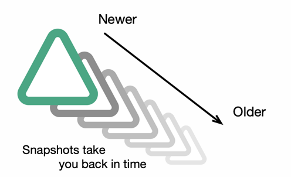

# Database

## How database stores the runtime's data?

The Database component stores data - but it must be able to revert data using block number due to the finality uncertainty of blocks in blockchain.

To deal with such matter, Datafast Runtime use 1) block numbers & block hashes - so called a `Block-Pointer` to track the changes of data entities over blocks, and 2) store entities' data in a form of `Snapshot`.

<figure><figcaption></figcaption></figure>

* an entity defined in user's `graphql.schema` is basically a `Row` (in traditional term) in database. In Datafast Runtime, entity does not only exist as 1-single row. Instead, it exists as a collection of multiple snapshots - with a block-number value indicated when each snapshot is created. By then, a table of such entity does not use the entity's ID as `primary-key` - instead it use a tuple of `(entity_id, __block_number__)` as primary key. Another hidden field added is `__is_deleted__` to enable soft-delete mechanism

<figure><figcaption></figcaption></figure>

* This mechanism is invisible is to subgraph's author. When the subgraph's user call `load()` method on an entity, Database component will select the snapshot with the maximum `__block_number__` . If `__is_deleted__` is FALSE, this entity snapshot will be selected for result. Before returning the entity data to user, it will strip off the `__block_number__` field and `__is_deleted__` field.
* When user call `save()` method on an entity, a new entity snapshot will be created with the `__block_number__` being the current block number that runtime is processing. That new entity is saved to database.
* When user call `delete()` method on an entity, a new entity snapshot will still be created with the current block number, but the hidden field `__is_deleted__` will be marked True - which basically is a soft-delete mechanism. Past this block, calling `load()` on a snapshot where `__is_deleted__` is true will result in None returned.
* When reorg happens or manual revert is required, Database will hard-delete all the snapshots within the block range of the revert: changes will be removed, soft-delete will be removed etc.
* This design allows the runtime to remove data whose block-age is very old and no longer relevant to business. This helps reduce the cost of storage automatically & significantly.

## Component structure

Database component is made up of 2 sub-components:&#x20;

* **MemoryDB** - which basically a cache,
* **ExternDB** (the actual database client).

During the processing of a batch of block - called a _**Session**_, most database actions are cache-calls to reduce latency:

* `load()` will interact with the actual database if the call is cache-miss. When an entity data is read from the actual database, it will also be saved to cache and alive until the end of that **Session**
* `save()` will save an entity snapshot to cache during the Session and might be committed to the actual database at the end of Session - if that Snapshot is the entity's latest snapshot of such session

#### MemoryDB

MemoryDB is defined as

```rust
pub type EntityType = String;
pub type EntityID = String;
pub type FieldName = String;
pub type RawEntity = HashMap<FieldName, Value>;

type EntitySnapshots = Vec<RawEntity>;

#[derive(Default, Debug)]
pub struct MemoryDb(HashMap<EntityType, HashMap<EntityID, EntitySnapshots>>);

```

#### ExternDB

ExternDB is an enum with variants of database implementations. There is also a [trait](https://github.com/datafast-network/datafast-runtime/blob/main/src/database/extern\_db/mod.rs#L49) that all database implementations must comply to.

Currently, ExternDB has two variant implemented:

```rust
#[derive(Default)]
pub enum ExternDB {
    #[cfg(feature = "scylla")]
    Scylla(Scylladb),
    #[cfg(feature = "mongo")]
    Mongo(MongoDB),
    #[default]
    None,
}
```

## Commit data

An indexing session is a session where the runtime processes a batch of block queried from BlockSource client. During this session, all the calls to `save()`  & `delete()` on entities will result in new snapshots saved to MemoryDB. When the session is finished, Database component will proceed to commit phase - which is the action to commit all result data to the actual database.

```rust

db.commit_data(last_block_in_batch.clone()).await?;
db.remove_outdated_snapshots(last_block_in_batch.number).await?;
db.flush_cache().await?;

if let Some(history_size) = config.block_data_retention {
    if last_block_in_batch.number > history_size {
        db.clean_data_history(last_block_in_batch.number - history_size)
            .await?;
    }
}
```

After successful commit of data, database will proceed to

* removing oudated snapshots: which is removing snapshots that have been superseded by newer snapshots - given those snapshots are out of reorg threshold of the blockchain. Eg: `a snapshot written at block 100 will be removed if there is a new snapshot created at block 200`.
* flushing cache: remove all data in MemoryDB to save memory.
* cleaning data history: if the runtime is configured with maximum data history, database will remove data whose block-age is older than the maximum data history

## Revert data

Database Revert is called with a specific block-number - which typically is a fork-block when there is a reorg. When a revert is called, MemoryDB will be cleared, and ExternDB will delete all snapshots that have `__block_number__` equal or larger than the fork-block.
