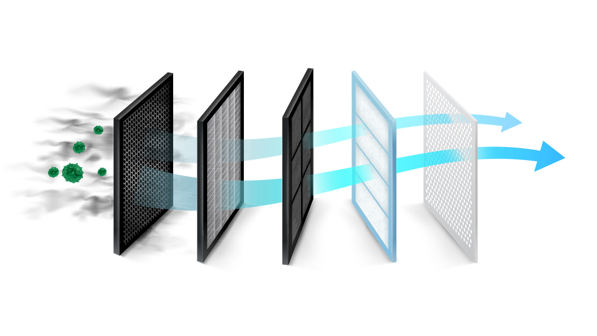

# DataFilter

The job of DataFilter is to only select relevant information for indexing.

<figure><figcaption></figcaption></figure>

DataFilter takes [BlockDataMessage](https://github.com/datafast-network/datafast-runtime/blob/main/src/common/messages.rs#L12C3-L12C3) and produces [FilteredDataMessage](https://github.com/datafast-network/datafast-runtime/blob/main/src/common/messages.rs#L40)

```rust
pub trait DataFilterTrait: Sized {
    fn handle_serialize_message(
        &self,
        data: BlockDataMessage,
    ) -> Result<FilteredDataMessage, FilterError>;
}
```

DataFilter's concrete implementation is very chain-specific. In case of Ethereum, it collects relevant logs and convert them to Ethereum Event data - based on the data format defined by TheGraph.

DataFilter does not need to be configured.
