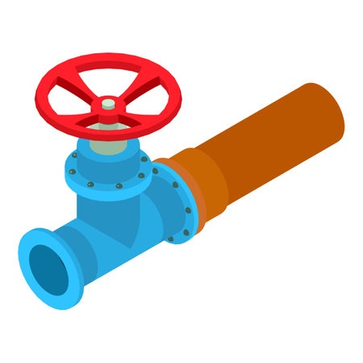

# Valve

<figure><figcaption></figcaption></figure>

Valve is the component that helps regulating "block/data flow" running from BlockSource's download process to runtime.&#x20;

When BlockSource ignites a download job, typically it will pull a large batch of blocks data from block store then send it away to Runtime for processing. Processing means indexing - and indexing this batch of block data might take some time due to the "blocking/sequential" nature of blockchain.&#x20;

During this processing time, Runtime cannot process any other batch of block data, thus the BlockSource client should not continue to download new batches until the Runtime is  almost available again.

Valve helps with this: it temporarily stops the download loop using `sleeping` mechanism and concurrently keeps track of number of blocks that have been processed -  typically using 2 values called `last_downloaded_block` & `last_processed_block`.

When the gap of these 2 values are small enough, Valve will open and let the BlockSource client continue the polling loop - download the next batch of blocks.

#### Configuration

Depending on the download speed of the BlockSource client, you can adjust Valve's behaviour: how long it should wait between checking and how much lagging between the downloaded block & the latest processed block. The config is laid as following:

```toml
[valve]
allowed_lag = 1000
wait_time = 10
```

`lag` is calculated by `(last_downloaded_block - last_processed_block)`

If the `lag` value is equal or less than the `allowed_lag` value, the Valve will open for the BlockSource to download the next batch of block

`wait_time` is number of seconds for Valve to sleep between the check up of the processing status.
